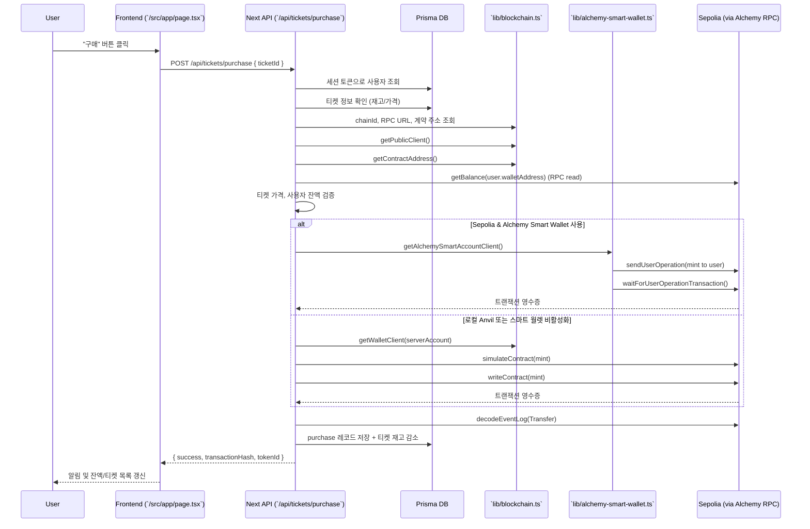

# 티켓 구매 플로우 (Sepolia/Alchemy 환경)

이 문서는 사용자가 프론트엔드에서 티켓 구매 버튼을 클릭했을 때, 백엔드가 어떻게 Alchemy RPC를 통해 Sepolia 네트워크와 상호작용하는지 단계별로 설명합니다. 또한 잔액 조회, 결제 요청 과정, 가스 비용이 발생하는 위치를 한눈에 파악할 수 있도록 정리했습니다.

## 구성 요소 요약

- **프론트엔드(`src/app/page.tsx`)**: 사용자가 `구매` 버튼을 누르면 `/api/tickets/purchase`로 POST 요청을 보냅니다. 티켓 목록·잔액 조회, 충전 요청도 각각 `/api/tickets`, `/api/balance`, `/api/wallet/fund`를 호출합니다.
- **Next.js API 라우트**: 서버 역할을 수행하며 세션 검증, DB 접근(Prisma), 스마트 컨트랙트 호출을 담당합니다.
  - `/api/tickets/purchase` — 티켓 발급 트랜잭션을 전송
  - `/api/wallet/fund` — 사용자 지갑으로 ETH 충전 트랜잭션 전송
  - `/api/balance`, `/api/transactions` — RPC **read** 호출로 상태 조회
- **`lib/blockchain.ts`**: `CHAIN_ID` 환경 변수에 따라 자동으로 활성 체인을 결정하고, `ALCHEMY_RPC_URL`·`ALCHEMY_API_KEY`를 바탕으로 Sepolia RPC 엔드포인트를 생성합니다.
- **`lib/alchemy-smart-wallet.ts`**: Sepolia 환경에서 Alchemy의 Light Account(스마트 월렛)를 초기화하고 User Operation을 전송합니다.
- **Sepolia 네트워크**: 실제 트랜잭션이 커밋되는 테스트넷. Alchemy RPC가 Sepolia 노드에 대한 프록시 역할을 합니다.

## 환경 변수와 네트워크 결정

`lib/blockchain.ts`는 다음 순서로 네트워크와 RPC를 정합니다.

1. `CHAIN_ID` 또는 `NEXT_PUBLIC_CHAIN_ID` → `config/contracts.json`의 `defaultNetwork` 순서로 체인 ID를 읽습니다.
2. `CHAIN_ID=11155111`이면 Sepolia, `CHAIN_ID=31337`이면 Anvil 로컬 체인을 사용합니다.
3. Sepolia 선택 시 `RPC_URL` → `ALCHEMY_RPC_URL` → `ALCHEMY_API_KEY` 순으로 RPC 엔드포인트를 확보합니다. API 키만 주어졌다면 `https://eth-sepolia.g.alchemy.com/v2/<API_KEY>` 형태로 URL을 조합합니다.
4. 모든 API 라우트는 `getPublicClient()`와 `getWalletClient()`가 반환하는 viem 클라이언트를 사용하므로, `.env.local`에 등록된 RPC 정보만 바꿔 줘도 전체 백엔드 동작이 Sepolia로 전환됩니다.

## 구매 요청 전체 흐름

### 주요 단계 설명

1. **프론트엔드 요청**: 클라이언트 컴포넌트가 티켓 ID와 함께 `/api/tickets/purchase`에 POST를 보냅니다.
2. **세션 및 DB 검증**: API 라우트가 세션 쿠키로 사용자를 확인하고, Prisma를 통해 티켓 재고/가격을 조회합니다.
3. **네트워크 설정**: `getChainId()`와 `getRpcUrl()`이 `.env.local` 값(`CHAIN_ID=11155111`, `ALCHEMY_RPC_URL` 등)으로부터 Sepolia RPC를 선택합니다. 컨트랙트 주소 역시 `CONTRACT_ADDRESS` 또는 `config/contracts.json`에서 읽어옵니다.
4. **잔액 확인**: viem `publicClient.getBalance`로 사용자 지갑의 ETH 잔액을 확인합니다. 이 호출은 RPC **read**이므로 가스 비용이 들지 않습니다(Alchemy 요금제의 API 호출 한도만 차감).
5. **User Operation 또는 EOAgas**:
   - **Sepolia + 스마트 월렛 활성화**: `createLightAccountAlchemyClient`로 초기화된 계정이 `sendUserOperation`을 호출해 TicketSBT 컨트랙트의 `mint(address)`를 실행합니다. User Operation은 Sepolia에 포함될 때 가스가 발생하며, 기본적으로 스마트 월렛 소유자의 ETH 또는 설정된 Gas Manager 정책이 비용을 부담합니다.
   - **로컬/백업 경로**: Anvil 또는 스마트 월렛 구성이 비활성화될 경우 서버가 보유한 프라이빗 키(`PRIVATE_KEY` 또는 Anvil 기본 키)로 `writeContract`를 호출합니다.
6. **이벤트 파싱 & 저장**: 트랜잭션 영수증에서 첫 로그(`Transfer` 이벤트)의 `tokenId`를 파싱한 뒤, DB에 구매 기록을 저장하고 티켓 재고를 1 감소시킵니다.
7. **응답 반환**: 트랜잭션 해시, Token ID, 블록 정보를 프론트에 응답하면, 프론트가 사용자에게 성공 알림을 보여주고 잔액/보유 NFT를 다시 로드합니다.

## 잔액 조회·보유 티켓 조회 흐름

- `/api/balance`: `getPublicClient()`가 반환한 viem 클라이언트로 `getBalance`, `readContract(balanceOf)`, `readContract(totalSupply)`를 호출합니다.
- `/api/transactions`: `getLogs` + `decodeEventLog`로 모든 `Transfer` 이벤트를 가져옵니다.
- 이 모든 호출은 RPC **read** 작업이라 가스 비용은 발생하지 않고, Alchemy의 API 요청만 소모합니다.

## 지갑 충전 흐름

- `/api/wallet/fund`는 사용자 잔액이 일정 수준 이하(0.5 ETH 기준)일 때 1 ETH를 전송합니다.
- Sepolia 환경에서는 스마트 월렛이 `sendUserOperation`으로 사용자 지갑에 ETH를 전송합니다.
- 로컬 Anvil에서는 서버가 보유한 프라이빗 키로 `walletClient.sendTransaction`을 호출합니다.
- 충전 트랜잭션 역시 Sepolia에 포함되므로 가스 비용이 발생합니다.

## 비용 발생 지점 정리

| 동작 | 가스 발생 여부 | 설명 |
| --- | --- | --- |
| 잔액 조회 (`getBalance`, `readContract`) | ❌ 없음 | RPC read 호출. 가스 소비 없이 최신 상태를 조회합니다. |
| 티켓 구매 (`sendUserOperation` → `mint`) | ✅ 있음 | 스마트 월렛 또는 서버 계정이 Sepolia에 트랜잭션을 제출하므로 가스가 필요합니다. |
| 지갑 충전 (`sendUserOperation` 또는 `sendTransaction`) | ✅ 있음 | ETH 전송 트랜잭션. 가스는 전송 주체(스마트 월렛/서버 계정)가 부담합니다. |
| 트랜잭션 히스토리 조회 (`getLogs`) | ❌ 없음 | 체인 데이터를 읽는 RPC 호출입니다. |

> **참고**: Sepolia는 테스트넷이므로 가스비도 테스트 ETH로 지불합니다. 하지만 실제 메인넷으로 이전할 경우 동일한 로직으로 메인넷 가스비가 발생합니다.

## 사용자 지갑과 결제 경로

- 사용자는 자체 EOA를 직접 연결하지 않습니다. 현재 구조에서는 **서버가 관리하는 스마트 월렛** 또는 **서버 프라이빗 키**가 트랜잭션 서명을 처리합니다.
- 사용자 테이블에는 `walletAddress`, `privateKeyHash`가 저장되어 있지만, 구매 시점에는 서버에서 대신 결제합니다(MVP 수준 로직). 추후 사용자 지갑 서명을 도입하려면 프론트에서 월렛 연결 흐름을 추가하고 API가 서명 명령만 위임하도록 변경해야 합니다.

## 정리

1. `.env.local`에 Sepolia/Alchemy 관련 변수를 지정하면 API 서버가 자동으로 해당 RPC에 연결합니다.
2. 프론트엔드는 Next API 라우트를 호출하고, 백엔드는 Prisma + viem + Alchemy 스마트 월렛을 통해 Sepolia에 트랜잭션을 전송합니다.
3. 잔액/보유 티켓 조회 같은 읽기 작업은 가스 비용이 없고, 구매·충전 같은 쓰기 작업은 Sepolia에서 가스가 발생합니다.
4. 현재 MVP에서는 서버 소유 키/스마트 월렛이 모든 결제 트랜잭션을 대행하며, 사용자는 웹 UI에서 클릭만 하면 됩니다.

이 문서를 토대로 프론트에서 결제 요청이 어떻게 Sepolia 네트워크까지 전달되는지 전체 흐름을 파악할 수 있습니다.
